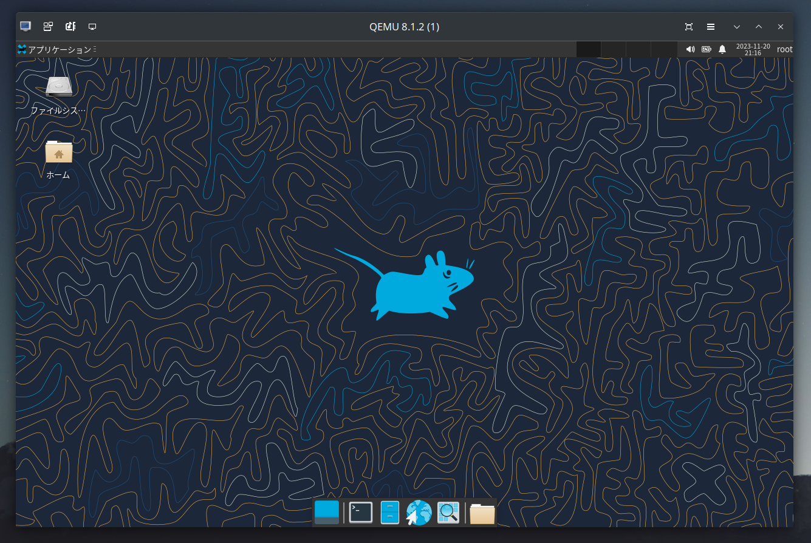

# archiso
`releng`プロファイルにパッケージを追加&調節したもの

## 変更点
- Xfce4デスクトップ
- PulseAudio
- 日本語表示対応
- 初期設定で日本語キーボードレイアウト
- ビープ音の無効化

## ビルド
```
$ sudo pacman -S archiso
$ git clone https://github.com/minetaro12/archiso
$ sudo mkarchiso -v -w ./archiso-tmp ./archiso
```

## スクリーンショット
